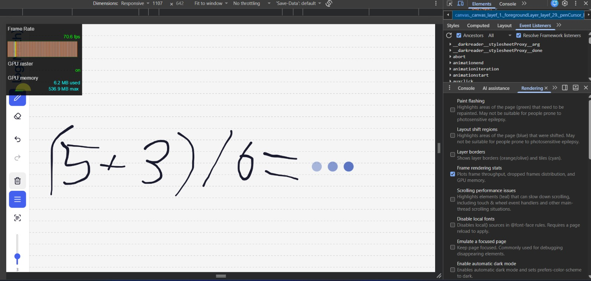
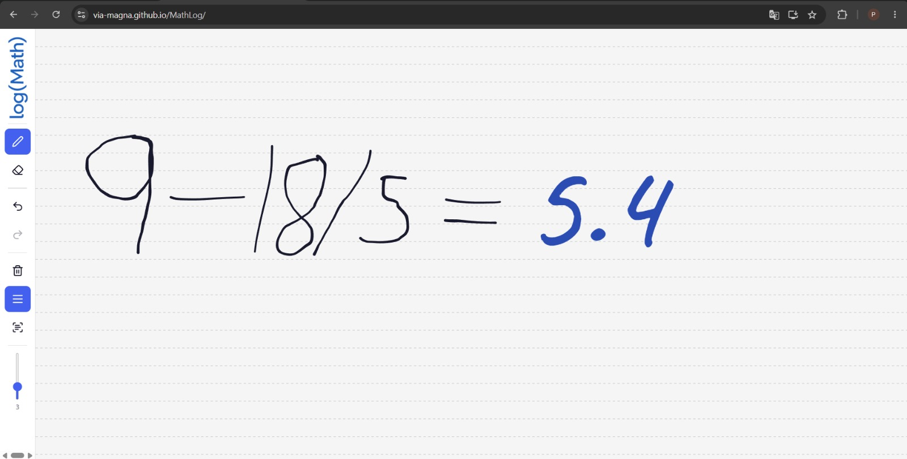
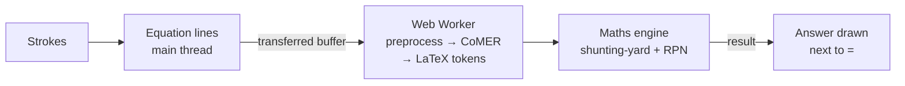

<p align="center">
  
</p>

<p align="center">
  <b>Write an equation by hand. The answer appears next to the <code>=</code>.</b><br />
  Handwriting recognition and maths run entirely in your browser, even in airplane mode.
</p>

<p align="center">
  <b><a href="#live-demo">Live demo</a></b> ·
  <a href="docs/ARCHITECTURE.md">Architecture</a> ·
  <a href="docs/PERFORMANCE.md">Performance &amp; offline proof</a>
</p>

---

log(Math) is our submission for the **CalcInk: On-Device Handwritten Math Calculator** problem (Inter IIT Tech Meet 15.0 Bootcamp, Software Development track). Write `18+4×3=` with a mouse, stylus or finger and `30` appears in handwriting next to the `=`. Erase a digit or rewrite it and the answer updates by itself.

## Highlights

- **100% on-device.** The handwriting model ([CoMER](#model-and-attribution) via ink-on) runs on ONNX Runtime Web in a Web Worker. Nothing is sent to a server; there is no server.
- **Works offline.** A service worker caches the app and the 7.4 MB model on the first visit. After that, airplane mode works. [Verified](docs/PERFORMANCE.md#results). On first load, it will take a while.
- **Smooth at 60 FPS.** Inference never runs on the main thread: ~58 FPS and zero long tasks measured while the model was running. 
- **No `eval()`.** Our own tokenizer, shunting-yard parser and RPN evaluator, with BODMAS, decimals, negative numbers, brackets and `Undefined` for division by zero.
- **Live editing.** Erasing, rewriting, undo and redo update answers automatically; undo is instant thanks to a result cache.
- **Digital-paper feel.** Answers in handwriting ink, sized to your writing, fading in and crossfading on edits, with thinking dots and an optional "what I read" hint.
- **Tested.** 422 automated tests, including 4,000 randomized maths cases checked against a separate reference evaluator. CI runs lint, tests and the build on every pull request.

## Live demo

**➜ Live demo: https://via-magna.github.io/MathLog/**

Try `18+4×3=`, `0.1+0.2=`, `12÷0=` and `-(2+3)×4=`, then erase and rewrite a digit. Add `?debug` to the URL to see each line's recognition box, what the model read and the inference time.



## Quick start

Requires Node.js 22.12+ and npm.

```bash
npm ci          # install dependencies
npm run dev     # start at http://localhost:5173 (copies the ONNX Runtime files first)
```

The model files are committed in `public/models/comer/`. If they are ever missing, run `npm run models` to download them (7.4 MB).

| Command | Purpose |
| --- | --- |
| `npm run dev` | Development server with hot reload |
| `npm run build` | Type-check, build to `dist/`, and generate the offline service worker |
| `npm run preview` | Serve the production build locally (offline mode works here) |
| `npm test` | Run all 422 tests (Vitest) |
| `npm run lint` | Lint with Oxlint |
| `npm run models` | Re-download the CoMER model files |

## How to use it

| Control | Shortcut | What it does |
| --- | --- | --- |
| Pen | **P** | Draw with mouse, touch or stylus |
| Eraser | **E** | Erase exactly under the round cursor; each gesture is one undo step |
| Undo / Redo | **Ctrl/Cmd+Z**, **Ctrl/Cmd+Shift+Z** or **Ctrl/Cmd+Y** | Answers come back instantly |
| Clear canvas | | Undo can restore it |
| Toggle lines | | Ruled-paper background |
| Show readings | **R** | Faint text under each line showing what the model read |
| Width slider | | Pen size or eraser radius (1–10) |

Write one equation per line and end it with `=`. Answers appear about 0.5–2 s after you lift the pen. Unreadable lines show `?`, with a hint saying what was read. On phones the toolbar moves to the bottom.

## How it works



1. **Canvas.** Strokes are captured with pointer events and drawn with `perfect-freehand` on layered, HiDPI-scaled canvases.
2. **Lines.** Strokes are grouped into equation lines. Erased ink is removed, and only lines that changed are sent, 400 ms after the pen stops.
3. **Recognition (Web Worker).** Each line is rendered into a tensor on an `OffscreenCanvas` and read by the CoMER model in ONNX Runtime Web (multi-threaded WASM), giving LaTeX tokens like `1 8 + 4 \times 3 =`.
4. **Maths.** Tokens are mapped to symbols and evaluated by our own parser, still in the worker.
5. **Answer.** The `=` is found geometrically and the answer is drawn just right of it.

The full design, with the reasoning behind each decision, is in **[docs/ARCHITECTURE.md](docs/ARCHITECTURE.md)**.

### Why ONNX Runtime Web in a Web Worker?

- **ONNX** because the pre-trained model ships as INT8 ONNX (7.4 MB). ONNX Runtime Web is the reference runtime, runs on WASM in every modern browser, and needs no conversion step.
- **A dedicated Web Worker** because encoder and decoder runs take hundreds of milliseconds. On the main thread they would freeze the pen. In the worker the UI thread only groups strokes and draws, which is how drawing stays at 60 FPS while the model works ([measurements](docs/PERFORMANCE.md)).
- **Multi-threaded WASM** via cross-origin isolation (COOP/COEP headers, or the service worker where a host can't set headers) speeds inference up further on multi-core devices.

## Offline and deployment

`npm run build` writes a service worker (`dist/sw.js`, generated by `scripts/build-sw.mjs`) that precaches the app, the Caveat font, the ONNX Runtime WASM files and the model, about 37 MB. After one online visit an "Available offline" badge appears, and the app works with no network. You can install it as an app (PWA) from the browser menu.

Any static host works. The configs are already in the repo:

| Host | How |
| --- | --- |
| **GitHub Pages** | Settings → Pages → Source: **GitHub Actions**. `.github/workflows/deploy.yml` builds and publishes on every push to `main`. The service worker adds the isolation headers Pages can't set. |
| **Vercel** | Import the repository; `vercel.json` sets the build and the COOP/COEP headers. |
| **Netlify / Cloudflare Pages** | Build command `npm run build`, output `dist`; `public/_headers` sets the headers. |

## Model and attribution

| | |
| --- | --- |
| Model | **CoMER**: W. Zhao and L. Gao, *CoMER: Modeling Coverage for Transformer-based Handwritten Mathematical Expression Recognition*, ECCV 2022 |
| Source | [kimseungdae/ink-on](https://github.com/kimseungdae/ink-on): INT8 ONNX export (`encoder_int8.onnx` 3.4 MB, `decoder_int8.onnx` 4.0 MB, `vocab.json`) and inference engine |
| Licence | **Apache-2.0** |
| Architecture | DenseNet encoder + Transformer encoder; autoregressive Transformer decoder with coverage attention; beam search (width 3, 1 on slow devices). 113-token LaTeX vocabulary, masked to digits and operators (`number` mode) |
| Our changes | None to the weights. The stroke preprocessing is ported to `OffscreenCanvas` so it runs in a worker (`src/recognition/preprocess*.ts`, with credit) |

Other open-source components: ONNX Runtime Web (MIT), perfect-freehand (MIT), Caveat font (SIL OFL 1.1), React (MIT), Zustand (MIT), Lucide icons (ISC).

## Project structure

```
src/
  components/   Canvas layers, toolbar, answer layer, status badges
  store/        Zustand stores: strokes + undo/redo, recognition results
  recognition/  Line grouping, worker protocol, scheduler, client, ink-on adapter, worker
  math/         Tokenizer, shunting-yard parser, RPN evaluator, formatting (no eval)
  answers/      Answer text, placement, slot state machine, renderer
  pwa/          Service-worker registration and offline status
scripts/        ONNX Runtime copy, model download, service-worker generator
public/         Model files, icons, web manifest, host headers
tests/          Vitest suites for every module (422 tests)
docs/           Architecture, performance and offline verification
```

## Testing

```bash
npm test
```

| Area | What's covered |
| --- | --- |
| Maths | Tokenizer, parser, evaluator, formatting; 50-row expected-answer table; 4,000 seeded random cases; a check that `src/` never uses `eval`/`Function` |
| Recognition | Line grouping, eraser handling, stroke packing (coordinate conversion), preprocessing maths, worker queue, client timeouts and crash recovery, scheduler timing |
| Answers | Text, placement, state machine, renderer |
| Canvas | Renderer command order, pointer gestures, HiDPI scaling, undo/redo |
| Offline | Service-worker precache list and versioning |

Frame rate and airplane mode were also verified in a real browser; see [docs/PERFORMANCE.md](docs/PERFORMANCE.md). Manual canvas checks are listed in [tests/README.md](tests/README.md).

## Known limitations

- An `=` written as a single stroke isn't found geometrically; the answer then goes after the line's right edge.
- Only `+ − × ÷`, decimals and brackets are evaluated; powers, roots and variables show `?`.
- Answers can't be erased with the eraser, and drawings aren't saved between visits.
- Recognition takes about 0.5–2 s per line, depending on the device.

## Team

Built by @manavsep, @PrinceK-Git and @PersonInDisguise. We worked through issues and pull requests, one per phase:

| Phase | Scope |
| --- | --- |
| 1 | Canvas, pen and pixel eraser, undo/redo, HiDPI, regression tests |
| 2 | Maths engine: tokenizer, shunting-yard, RPN, edge cases, tests |
| 3 | On-device recognition: ink-on in a Web Worker, line grouping, scheduling |
| 4 | Answers on the canvas, reactive editing, micro-interactions, accessibility |
| 5 | Offline PWA, deployment, performance verification, documentation |
