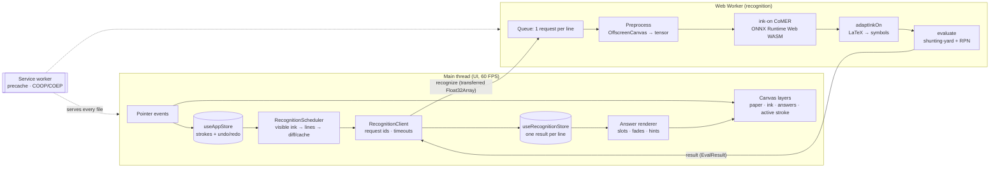

# log(Math) architecture

log(Math) (the CalcInk problem statement) is a digital notebook: you write an equation by hand, and the answer appears in handwriting next to the `=`. Everything runs in the browser. Strokes, image preprocessing, neural-network inference and maths never leave the device, and after one visit the app works with no network at all.

This document explains how the parts fit together and why each design choice was made. Setup and usage are in the [README](../README.md); measured performance is in [PERFORMANCE.md](PERFORMANCE.md).

## 1. Requirements that shaped the design

| Requirement (from the brief) | Design response |
| --- | --- |
| 100% on-device, no cloud APIs | ONNX model + ONNX Runtime Web served from our own origin; no network calls at runtime |
| Works offline (airplane mode) | Service worker precaches HTML, JS, fonts, WASM runtime and model (§8) |
| 60 FPS while recognizing | All inference in a dedicated Web Worker; main thread only groups strokes and draws (§5, §9) |
| No `eval()`; graceful errors | Hand-written tokenizer, shunting-yard parser and RPN evaluator; typed results instead of exceptions (§6) |
| BODMAS, decimals, negatives; `÷0` → Undefined | Precedence table with unary minus; display rounding to 12 significant digits (§6) |
| Answer next to `=`, live updates on edit | Geometric `=` detection, answer slots that survive edits, result cache for undo/redo (§7) |
| Pre-trained open-source model | [ink-on](https://github.com/kimseungdae/ink-on): CoMER (ECCV 2022), INT8 ONNX, Apache-2.0 (§4) |

## 2. System overview



The pipeline has five stages, which were built as five phases:

| Phase | Module | Thread | Input → output |
| --- | --- | --- | --- |
| 1 | Canvas (`src/components/Canvas`, `src/store`) | Main | Pointer events → `Stroke[]` with undo/redo |
| 3 | Recognition (`src/recognition`) | Main + worker | Strokes → equation lines → LaTeX tokens |
| 2 | Maths engine (`src/math`) | Worker | Tokens → `EvalResult` (`ok`, `undefined`, `error`, `pending`) |
| 4 | Answers (`src/answers`) | Main | Line results → answers drawn next to `=` |
| 5 | Offline + deploy (`scripts/`, `src/pwa`) | Service worker | Network → cache |

## 3. Canvas and input (Phase 1)

- **Layers.** Five stacked layers keep each redraw cheap: (1) paper and ruled lines, (2) committed ink, (3) answers and reading hints, (4) the stroke being drawn, (5) cursor, badges and debug overlay. Drawing a stroke only repaints layer 4 in `requestAnimationFrame`, and the stroke is committed to layer 2 on pointer-up.
- **Ink.** `perfect-freehand` turns sampled points into smooth, pressure-sensitive outlines. Coordinates are logical CSS pixels; each canvas bitmap is scaled by `devicePixelRatio`, so ink is sharp on high-DPI screens.
- **Eraser.** A pixel eraser: each erasing gesture is stored as an `isEraser` stroke and replayed with `destination-out`, so it erases exactly what the cursor covers, is undoable, and never touches the paper layer.
- **State.** Zustand holds strokes and snapshot-based undo/redo (50 levels). Strokes are the single source of truth; every other view is derived from them.

## 4. Choosing the model

The original plan used a per-symbol classifier (`Otman404/Mathematical_Symbols_Recognition`, 82 classes, 45×45 crops). We switched to **ink-on**, which runs **CoMER** (Coverage-guided Multi-scale Encoder-decoder Transformer, ECCV 2022), for these reasons:

| | Per-symbol classifier | ink-on / CoMER (chosen) |
| --- | --- | --- |
| Unit of recognition | One character at a time; needs our own character segmentation | Whole expression in one pass |
| Hard cases | Splitting `=` and `÷` into strokes, touching digits | Handled by the model's attention |
| Output | Class per crop | LaTeX token sequence |
| Format | Keras; needs `tf2onnx` conversion | INT8 ONNX ready to use (encoder 3.4 MB + decoder 4.0 MB) |
| Licence | – | Apache-2.0 |

**Trade-offs we accepted:** CoMER returns no per-token confidence and no token-to-stroke positions, and inference takes about 0.5–2 s per line. The design compensates for each: §7 finds the `=` geometrically, §7 shows what the model read as a hint, and §5 hides latency (idle debounce, caching, thinking dots).

**Runtime choice: ONNX Runtime Web (WASM).** The model ships as ONNX, the runtime is the reference implementation, and multi-threaded SIMD WASM is fast and works in every modern browser. WebGPU is supported but off by default, because INT8 models usually run faster on WASM.

## 5. Recognition pipeline (Phase 3)

1. **Visible ink.** `visibleInk.ts` drops ink fully covered by a later eraser stroke, so erased digits disappear from what the model sees.
2. **Line grouping.** `lineGrouping.ts` splits strokes into equation lines by vertical overlap. Small strokes (decimal points, `−`, `=` bars, `÷` dots) attach to the nearest line, and wide horizontal gaps split side-by-side equations. Each line gets a **stable key** (hash of its stroke ids plus the ids of erasers cutting it), so an unchanged line is never re-recognized.
3. **Scheduling.** `RecognitionScheduler` re-groups lines on every add, erase, undo, redo or clear. Changed lines are sent **400 ms after the pen stops**, never while it is down; the line with the newest stroke goes first. Results are cached per key (LRU, 200 entries), so undo and redo restore answers instantly.
4. **Transport.** `RecognitionClient` posts each line as a transferred `Float32Array` (no copy) and tags it with a request id. It drops stale and out-of-order results, times out after 10 s, and restarts the worker once if it crashes.
5. **Worker.** One inference at a time (ONNX sessions aren't re-entrant), with at most one queued request per line. Preprocessing ports ink-on's algorithm to `OffscreenCanvas` (the original needs `document`, which workers lack): render strokes white on black, cut erased ink, scale to 128 px content inside a 256 px tensor, build the padding mask. Then CoMER decodes in `number` mode (vocabulary masked to digits, operators and brackets), beam width 3, dropping to 1 on slow devices.
6. **Adapter.** `adaptInkOn` maps 19 LaTeX tokens (`\times`, `\cdot`, `\div`, …) onto 18 canonical symbols and rejects anything else (`\frac`, `^`, letters) as `UNKNOWN_SYMBOL`. A letter `x` between two operands is read as ×.

**Failure handling.** Model load failure → retry once, then a "Recognition unavailable" badge (drawing keeps working). WebGPU failure → WASM. No `SharedArrayBuffer` → single thread. Every failure has one code and one visible state.

## 6. Maths engine (Phase 2)

A deterministic engine written from scratch; there is no `eval`, `Function` or maths library, and a test scans `src/` to keep it that way.

```
symbols → tokenize → toRPN (shunting-yard) → evaluateRPN → formatNumber
```

- **Tokenizer:** merges digit runs into numbers (`.5` → `0.5`), detects unary minus by context, inserts implicit `×` for `2(3)`, and stops at the first `=`.
- **Parser:** Dijkstra's shunting-yard algorithm with a precedence table (`neg` > `× ÷` > `+ −`, left-associative), validating syntax in the same pass.
- **Evaluator:** stack machine in IEEE-754 doubles; `x ÷ 0` → `Undefined`; non-finite results → `OVERFLOW`.
- **Display:** rounds to 12 significant digits (`0.1+0.2` → `0.3`) and uses exponent form outside 1e-6 to 1e12.
- **Never throws:** every stage returns a typed `Result`. Before `=` is written, errors stay hidden (`pending`), so half-written lines never flash a `?`.

## 7. Answers on the paper (Phase 4)

- **Where:** `findEquals` locates the `=` from geometry (two short, flat, stacked strokes at the right of the line), because the model gives no positions. The answer is drawn just right of it, with digits as tall as the user's (18–120 px), moving below if it would overlap the canvas edge or another equation.
- **What:** `30`, `Undefined`, `?` (with a hint showing what was read and why it failed), or nothing.
- **Stability:** each equation has an *answer slot* that survives key changes (`hidden → thinking → shown → stale`). After an edit the old answer stays up, dimmed, until the new reading arrives, then crossfades, so answers never blink off during the 1–2 s re-read.
- **Feel:** thinking dots, fades, the bundled Caveat handwriting font; `prefers-reduced-motion` disables animation.
- **Accessibility:** the answer canvas is `aria-hidden`; an `aria-live` region announces "18 plus 4 times 3 equals 30".

## 8. Offline and deployment (Phase 5)

**Service worker without a plugin.** `scripts/build-sw.mjs` runs after `vite build`. It lists every file in `dist/`, removes a 28 MB duplicate WASM file that Vite emits but the app never loads, and writes `dist/sw.js` with a precache list and a content-hash version. We chose a small generated worker over `vite-plugin-pwa` because it has no dependencies, its behaviour is fully visible in about 100 lines, and it does one thing a generic plugin doesn't: it adds the isolation headers itself (below).

| Request | Strategy |
| --- | --- |
| Install | Precache everything (~37 MB: app, fonts, `ort-wasm-simd-threaded.jsep.{mjs,wasm}`, CoMER encoder/decoder, vocab) |
| Navigation | Network first; cached app shell when offline |
| Everything else (same origin) | Cache first; anything missed is cached at runtime |
| New deploy | New hash → new cache; old caches deleted on activate |

**Cross-origin isolation.** Multi-threaded WASM needs `SharedArrayBuffer`, which needs `Cross-Origin-Opener-Policy: same-origin` and `Cross-Origin-Embedder-Policy: require-corp`. Vercel (`vercel.json`), Netlify and Cloudflare Pages (`public/_headers`) send them. GitHub Pages cannot set headers, so the service worker adds them to every response it serves. On the very first visit the page reloads once after the worker installs, but only if nothing has been drawn yet. Without isolation the app still works, on one thread.

**Only the runtime that's used.** `scripts/copy-ort.mjs` copies just the `jsep` WASM build that ONNX Runtime actually loads (checked in the browser's network log). Together with removing the duplicate, this shrinks `dist/` from about 118 MB to about 37 MB.

**Base path.** `BASE_PATH` sets Vite's `base` for GitHub Pages (`/<repo>/`); model, runtime, worker, manifest and service-worker URLs are all derived from it.

## 9. Performance

The main thread does only cheap, bounded work: grouping lines (O(n log n), under 1 ms for 200 strokes), packing points, and drawing. Inference, preprocessing and evaluation run in the worker. Measured in Chromium while recognition was running, the page held ~58 FPS with a 16.7 ms median frame and no main-thread long tasks, the same as with recognition idle. Details and method: [PERFORMANCE.md](PERFORMANCE.md).

## 10. Testing

| Area | Tests |
| --- | --- |
| Maths | Tokenizer, parser, evaluator, formatting; 50-row expected-answer table; 4,000 seeded random cases checked against a separate reference evaluator; a scan that `src/` never uses `eval`/`Function` |
| Recognition | Line grouping, visible ink, stroke packing, preprocessing maths, worker queue (fake engine), client (stale results, timeouts, crash restart), scheduler (fake timers), `=` detection, adapter |
| Answers | Text, placement, slot state machine, renderer (mock canvas) |
| Canvas | Renderer command order, pointer gestures, layer scaling, store undo/redo |
| Offline | Service-worker generator: precache list, duplicate removal, version hashing |

422 tests in total, run by `npm test` and in CI on every push and pull request. Offline behaviour and frame rate were additionally verified in a real Chromium browser (see PERFORMANCE.md).

## 11. Known limitations

- An `=` written as a single stroke is not found geometrically; the answer is then placed after the line's right edge.
- Recognition takes about 0.5–2 s per line, depending on the device.
- Answers can't be erased with the eraser, and drawings aren't saved between visits.
- Only `+ − × ÷`, decimals and brackets are evaluated; powers, roots and variables are rejected with `?`.

## 12. Licences and credits

| Component | Licence |
| --- | --- |
| [ink-on](https://github.com/kimseungdae/ink-on) by kimseungdae (CoMER INT8 ONNX models, inference engine; preprocessing ported in `src/recognition/preprocess*.ts`) | Apache-2.0 |
| CoMER model: W. Zhao and L. Gao, *CoMER: Modeling Coverage for Transformer-based Handwritten Mathematical Expression Recognition*, ECCV 2022 | Paper; the ONNX weights we use are distributed by ink-on under Apache-2.0 |
| [ONNX Runtime Web](https://github.com/microsoft/onnxruntime) | MIT |
| [perfect-freehand](https://github.com/steveruizok/perfect-freehand) | MIT |
| [Caveat](https://fonts.google.com/specimen/Caveat) font via @fontsource | SIL OFL 1.1 |
| React, Zustand, Lucide | MIT / MIT / ISC |
